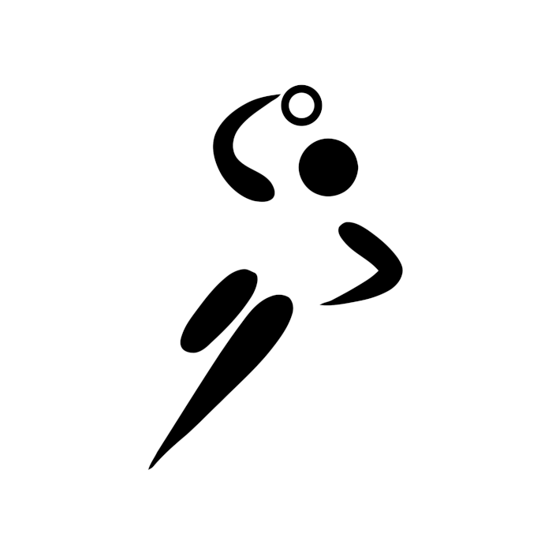

<h1 align="center">
  <br>
  <a href="http://app.kalmbach.dev"></a>
  <br>
  Top Tips - Server
  <br>
</h1>

<h4 align="center">The server for a lightweight handball guessing game. See <a href="https://github.com/Tobi2K/TopTips-App">TopTips-App</a></h4>
<br>
<p align="center">
  <a href="#readme">
    
  </a>
  <a href="#readme">
    
  </a>
  <a href="#license">
    
  </a>
  <a href="#readme">
    
  </a>
</p>
<p align="center">
  <a href="#readme">
    
  </a>
  <a href="https://www.codefactor.io/repository/github/tobi2k/toptips-server">
    
  </a>
  <a href="https://depfu.com/repos/github/Tobi2K/TopTips-Server?project_id=35394">
    
  </a>
  <a href="#readme">
    </a>
  <a href="#readme">
    
  </a>
  <br>
  <a href="#readme">
    
  </a>
  <a href="#readme">
    
  </a>
</p>

## What?

This is the server part of [Top Tips](https://github.com/Tobi2K/TopTips-App). Top Tips is a handball guessing game available on [Google Play](https://play.google.com/store/apps/details?id=app.kalmbach.dev) or [online](https://app.kalmbach.dev).

## How?

This server is an API built with [nest](https://nestjs.com/). It maintains user accounts and groups, leagues, seasons, games, guesses and points. Game data is provided by [Sportradar](https://sportradar.com/)

## Installation

Clone project and install dependencies

```bash
git clone https://github.com/Tobi2K/TopTips-Server.git
cd TopTips-Server && npm i
```

Run the server

```bash
npm run start
```

## License

MIT License

Copyright (c) 2022 Tobias Kalmbach

Permission is hereby granted, free of charge, to any person obtaining a copy of this software and associated documentation files (the "Software"), to deal in the Software without restriction, including without limitation the rights to use, copy, modify, merge, publish, distribute, sublicense, and/or sell copies of the Software, and to permit persons to whom the Software is furnished to do so, subject to the following conditions:

The above copyright notice and this permission notice shall be included in all copies or substantial portions of the Software.

THE SOFTWARE IS PROVIDED "AS IS", WITHOUT WARRANTY OF ANY KIND, EXPRESS OR IMPLIED, INCLUDING BUT NOT LIMITED TO THE WARRANTIES OF MERCHANTABILITY, FITNESS FOR A PARTICULAR PURPOSE AND NONINFRINGEMENT. IN NO EVENT SHALL THE AUTHORS OR COPYRIGHT HOLDERS BE LIABLE FOR ANY CLAIM, DAMAGES OR OTHER LIABILITY, WHETHER IN AN ACTION OF CONTRACT, TORT OR OTHERWISE, ARISING FROM, OUT OF OR IN CONNECTION WITH THE SOFTWARE OR THE USE OR OTHER DEALINGS IN THE SOFTWARE.

---

> [kalmbach.dev](https://www.kalmbach.dev) &nbsp;&middot;&nbsp;
> GitHub [@Tobi2K](https://github.com/Tobi2K) &nbsp;&middot;&nbsp;
> Email [t.kalmbach35@gmail.com](mailto:t.kalmbach35@gmail.com)